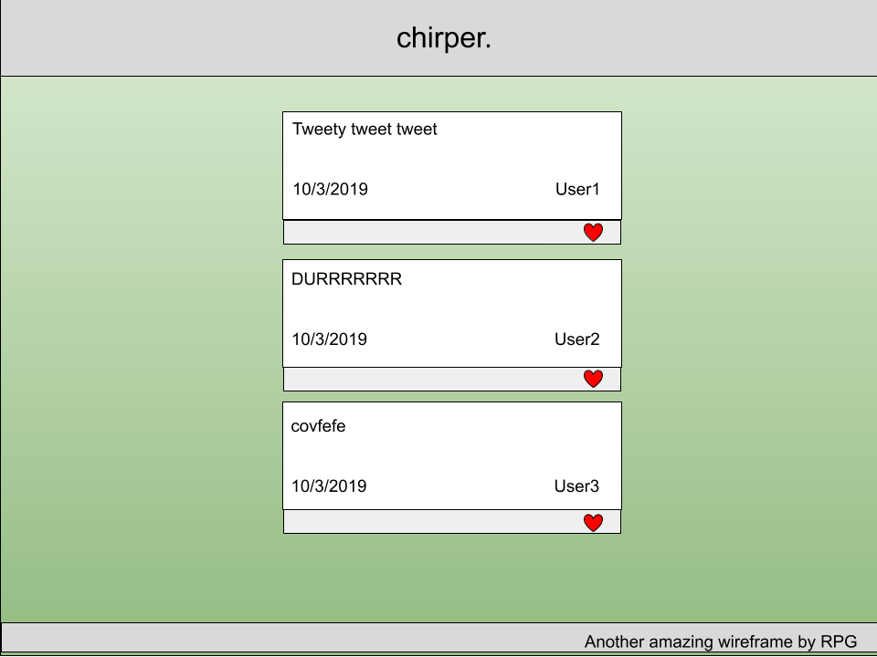
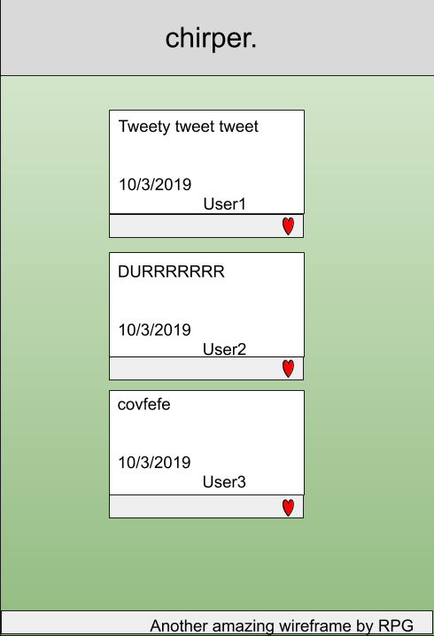
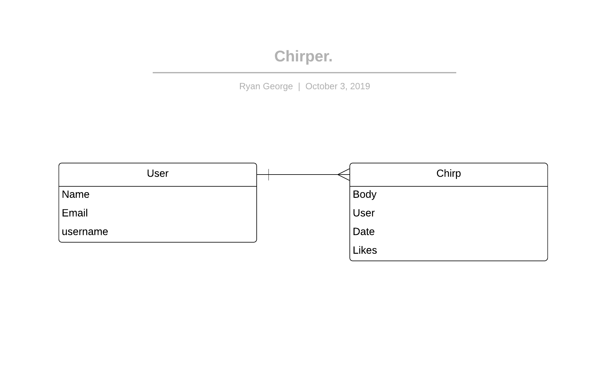

# Project 4
### By: RYAN GEORGE
# Chirper - a place for chirps

## Chirper is a twitter clone app that allows a user to create short posts, or "chirps". Share your thoughts, read what others are chirping about, and add a squawk (like) to other chirps to let them know it ruffled your feathers. 

---

---

### Technologies Used:

* React
* Express
* Node.js
* MongoDB

### Getting Started:

* [Trello Board](https://trello.com/b/iQjnl53i/project-4)
* [Heroku Deployment App (coming soon)](https://heroku.com)

 

### Unsolved Problems:

 

### Future Enhancements: